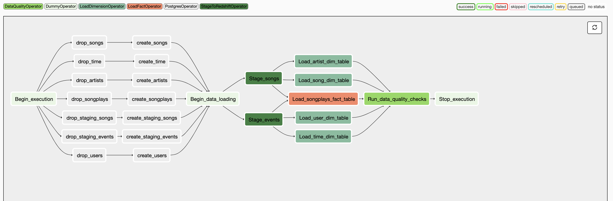

# Udactiy Data Pipelines With Airflow
This project focuses on building a star schema from a subset of real data from the [Million Song Dataset](https://labrosa.ee.columbia.edu/millionsong/) and log files in JSON format generated by this [event simulator](https://github.com/Interana/eventsim) based on the songs in the dataset above.
The project uses AWS and especially Redshift, an optimized postgres databased tuned for data warehousing capabilities.
The project provides the table modelling and etl pipeline to populate a Redshift cluster for analytics purposes for the fictitious company Sparkify.
The piepine is configured through Apache Airflow that schedules the required jobs to pull data from s3, create the relevant staging and alaytics tables and load the data
## Installation
The following steps must be followed before running the project:
* Create IAM role for Redshift
* Create security group that will be attached
* Create Redshift cluster
* Add the dags and plugins folder to airflow's workspace

## Configuration 
The following connections must be created in airflow before enabling the dag

1) Setting a connection to the created redshift cluster
2) Setting a connection for the aws -credentials that have access to s3 (Alternatively an IAM role can be used)

## Database schema design and ETL process
This database that is being created helps the fictional company Sparkify create a fact and dimensions (star schema). That enables to:
* Supporting de-normalized data
* Enforcing referential integrity
* Reducing the time required to load large batches of data into a database 
* Improving query performance, i.e. queries generally run faster
* Enabling dimensional tables to be easily updated
* Enabling new ‘facts’ to be easily added i.e. regularly or selectively
* Simplicity i.e. navigating through the data is easy (analytical queries are easier)

#### Database design
For the database the decision was made to create 5 tables with 1 fact table (songplays ) storing the fake events and 4 dimension tables 
There are also 2 staging tables that hold the s3 data ase the exists in the corresponding buckets
* songplays
* users
* artists
* songs
* time

* staging_events
* staging_songs

#### ETL
Airflow orchestrates all the pipeline jobs that consist of:
* Drop the redshift tables if the exist
* Create the tables in redshift
* Copy the data from s3 to redshift into the staging tables using the COPY commnand
* Populate the analytics tables
* Check the data quality issuing some check sql queries

